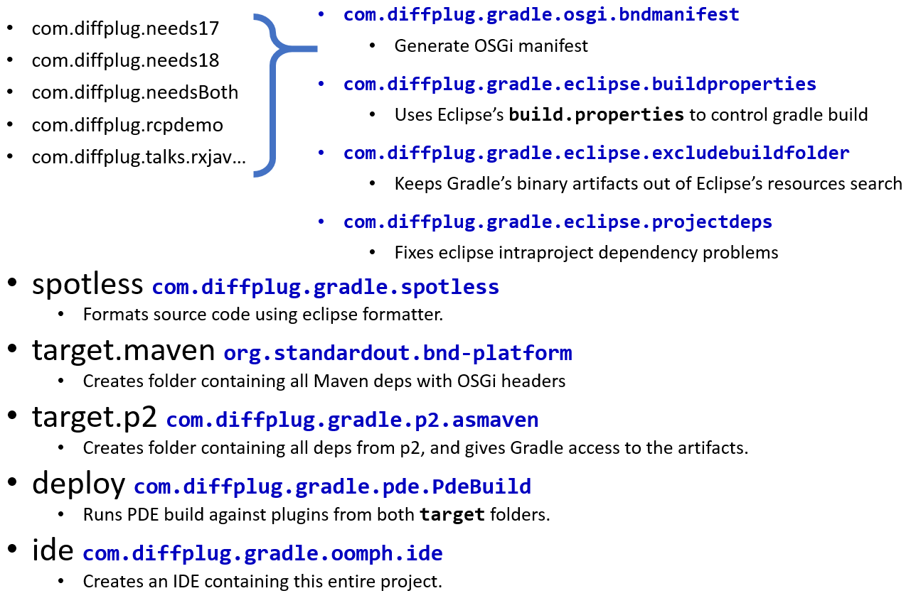

# Gradle and Eclipse RCP

<!---freshmark shields
output = [
	link(shield('Latest version', 'latest', '{{stable}}', 'blue'), 'https://github.com/{{org}}/{{name}}/releases/latest'),
	link(shield('License Apache', 'license', 'Apache', 'blue'), 'https://tldrlegal.com/license/apache-license-2.0-(apache-2.0)'),
	link(shield('Changelog', 'changelog', '{{version}}', 'brightgreen'), 'CHANGES.md'),
	link(image('Travis CI', 'https://travis-ci.org/{{org}}/{{name}}.svg?branch=master'), 'https://travis-ci.org/{{org}}/{{name}}')
	].join('\n');
-->

)

<!---freshmark /shields -->

This example project demonstrates building an Eclipse RCP application using the following techniques:

- Dependencies pulled from maven and p2
- Native launchers for Win/Mac/Linux
- Automatic OSGi metadata
- Two versions of the same library (Guava 17 and 18 at the same time)
- Generate IDE-as-build-artifact

Demo project for the [goomph](https://github.com/diffplug/goomph) Gradle plugin, also makes heavy use of [bnd-platform](https://github.com/stempler/bnd-platform).

### Quickstart

- `gradlew ide` opens an IDE for manipulating this project.
- `gradlew assemble.all` creates native launchers for win/mac/linux in the `deploy/build` folder.

### High level layout

The plugins are applied as follows:

## Details

See "Gradle and Eclipse RCP.pptx" in this repo for more details.  Based on a talk given at [Gradle Summit 2016](https://gradlesummit.com/schedule/gradle-and-eclipse-rcp) ([video](https://www.youtube.com/watch?v=PIC6YeRkRlo&feature=youtu.be)).

Currently a talk proposal (that you can vote on ;-) for [EclipseConverge 2017](https://www.eclipseconverge.org/na2017/session/gradle-and-eclipse-ide-build-artifact?utm_source=dlvr.it&utm_medium=twitter).

## Acknowledgements

* Many thanks to Simon Templer for the excellent [bnd-platform](https://github.com/stempler/bnd-platform).
* Be on the lookout for David Akehurst's work on p2 and Gradle (details in powerpoint).
* Andrey Hihlovskiy's excellent [Wuff](https://github.com/akhikhl/wuff) and [Unpuzzle](https://github.com/akhikhl/unpuzzle) libraries have been a huge boon to everyone trying to get Gradle and Eclipse to collaborate.
* Maintained by [DiffPlug](http://www.diffplug.com/).
